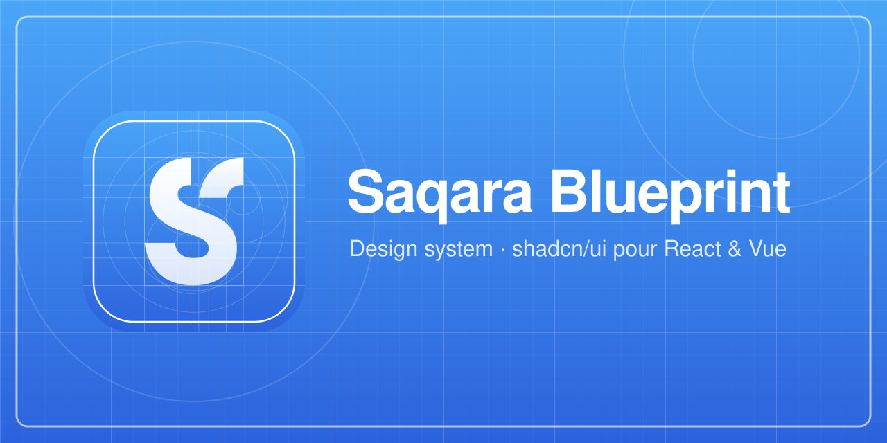

<p align="center"></p>

# Saqara Blueprint

Design system Saqara : un registry [shadcn/ui](https://ui.shadcn.com) (React) et [shadcn-vue](https://www.shadcn-vue.com) (Vue), aux couleurs Saqara.

Documentation : https://saqara.github.io/blueprint/ (index pour les IA : https://saqara.github.io/blueprint/llms.txt)

## Utiliser Blueprint dans une app

Prérequis : Tailwind v4 et `shadcn init` (React) ou `shadcn-vue init` (Vue) déjà faits.

1. Déclarer le registry dans `components.json` :

   ```jsonc
   // React
   "registries": { "@saqara": "https://saqara.github.io/blueprint/r/react/{name}.json" }
   // Vue
   "registries": { "@saqara": "https://saqara.github.io/blueprint/r/vue/{name}.json" }
   ```

2. Installer le thème, puis les composants :

   ```bash
   npx shadcn@latest add @saqara/saqara-theme @saqara/button        # React
   npx shadcn-vue@latest add @saqara/saqara-theme @saqara/button    # Vue
   ```

Composants qui demandent un élément racine :
- `tooltip` (React) : placer un `<TooltipProvider>` à la racine de l'app.
- `sonner` : monter `<Toaster />` une fois à la racine. En React, passer `theme="light" | "dark"` depuis le thème de l'app (défaut : `light`, comme en Vue). En Vue, la feuille de style de `vue-sonner` est importée par le composant (l'app doit déclarer les types `vite/client`, présents par défaut dans un projet Vite).

Composants Saqara (lot 3) :
- `data-table` : le tri est toujours contrôlé par la page (`sorting` + `onSortingChange`, Vue `v-model:sorting`) ; colonnes typées `ColumnDef<DataTableFeatures, Row, any>[]` (TanStack Table v9) ; pour l'en-tête collant, donner une hauteur max (`className="max-h-96"`).
- `stepper` : étapes numérotées à partir de 1 ; avec `linear` (défaut), on peut cliquer les étapes précédentes, l'étape en cours et la suivante (règle Reka, identique en React et en Vue).
- `file-dropzone` : sélection et validation seulement, l'app gère l'envoi.

Blocs (lot 4) — `npx shadcn add @saqara/app-shell-sidebar` (ou `app-shell-header`, `login`) :
- Les shells ne dépendent d'aucun routeur : `nav` (`{ id, label, icon?, badge?, href? }`), `activeId`, `onNavigate` (Vue `@navigate`).
- Thème : passer `theme` + `onThemeChange` (Vue `v-model:theme`) pour afficher la bascule ; l'app garde son stockage.
- `login` est purement visuel : l'app fait l'authentification et pilote `status` (`idle`, `loading`, `sent`) et `error`.
- En Vue, les callbacks facultatifs (`@sign-out`, `@sso`, `@forgot-password`…) n'affichent leur entrée que s'ils sont fournis.

Le code est copié dans l'app : il lui appartient. Pour récupérer une mise à jour, relancer `add` avec `--overwrite` et relire le diff.

## Développer

Node ≥ 24 et npm.

```bash
npm i
npm run dev            # site de doc sur http://localhost:5173/blueprint/
npm run vendor -- card # importe un composant officiel (React + Vue) dans registry/
npm run check          # parité, tests, types
npm run build          # registry JSON + vitrine dans dist/
npm run smoke          # installe tout dans des apps jetables (après build)
```

- Les couleurs se changent dans `tokens/theme.json`, jamais dans `src/theme.css` (généré).
- Chaque composant doit exister en React **et** en Vue, avec une démo dans `src/react/demos/` et `src/vue/demos/`, et une catégorie dans `site/catalog.ts`.
- Les exemples (écrans complets) vivent dans `src/examples/{react,vue}/`, dans les deux frameworks.
- `public/llms.txt` est généré par `npm run registry` depuis les manifestes.
- Un composant personnalisé ne se réimporte qu'avec `--force`, en connaissance de cause.
- TypeScript reste en 6.x tant que `vue-tsc` ne supporte pas TypeScript 7.
